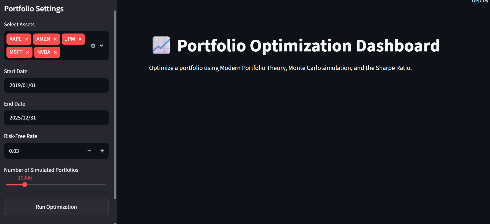
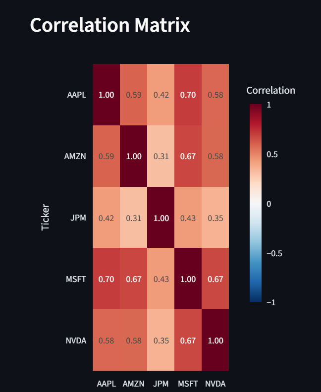
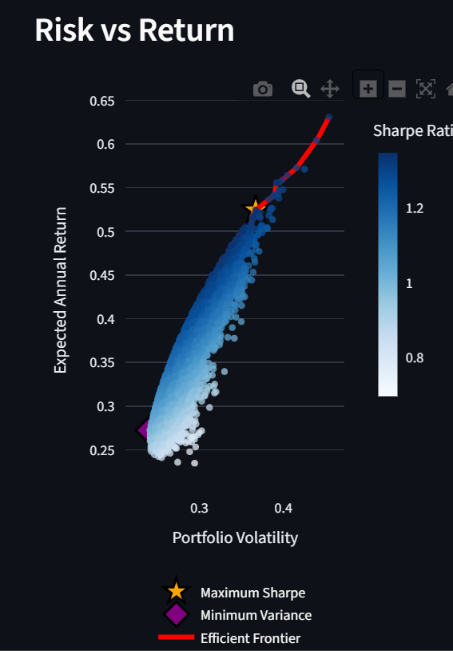
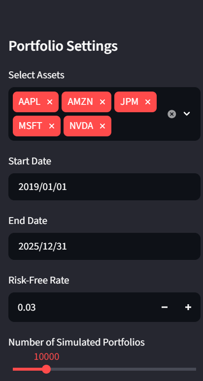
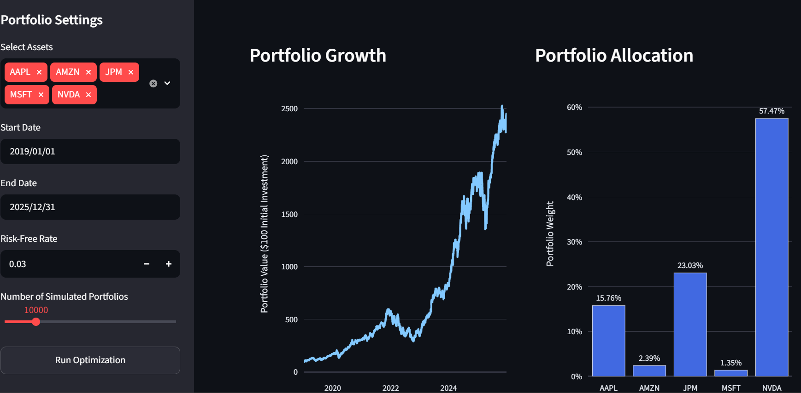
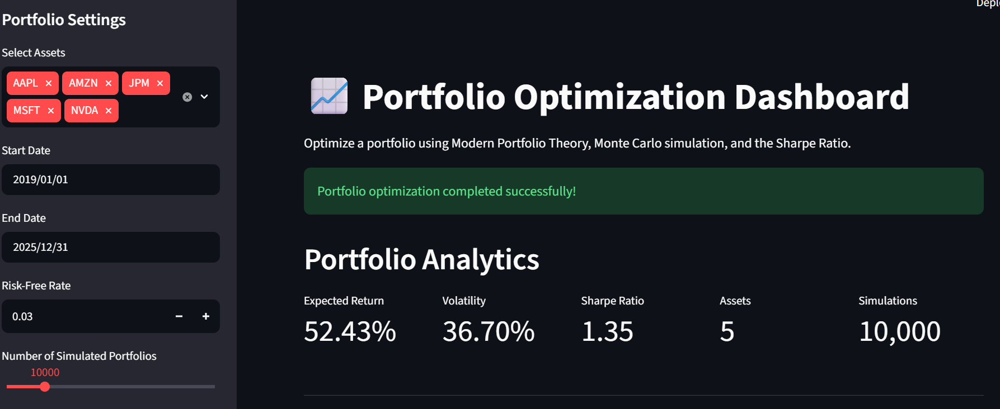

# Portfolio Optimization Dashboard

An interactive dashboard for constructing and analyzing investment portfolios using Modern Portfolio Theory (MPT).

> **Version:** v1.0

---

## Overview
This Portfolio Optimization Dashboard is an application that helps users analyze historical stock data, simulate thousands of possible portfolios using Monte Carlo simulation with the aim of identifying portfolios with attractive risk-return characteristics.

## Features

- Historical market data acquisition using Yahoo Finance
- Data cleaning and preprocessing
- Daily and annualized return calculations
- Portfolio risk and return analysis
- Monte Carlo portfolio optimization
- Maximum Sharpe Ratio portfolio identification
- Minimum Volatility portfolio identification
- Efficient Frontier visualization
- Interactive Streamlit dashboard
- Portfolio allocation charts

---

## Project Structure

```
Portfolio-Optimization-Dashboard
|
|-app.py
|-main.py
|-src/
|-tests/
|-data/
|-assets/
|-docs/
|-notebooks/
|_reports/

```
---

## Technologies Used

- Python
- Streamlit
- Pandas
- Numpy
- Plotly
- Matplotlib
- Scipy
- yfinance


## Installation

Clone the repository

```
git clone https://github.com/YOUR_USERNAME/Portfolio-Optimization-Dashboard.git
```

Install dependencies

```
pip install -r requirements.txt
```

Run the dashboard

```
streamlit run app.py
```

---

## Dashboard Preview

### Dashboard Home


### Correlation Heatmap


### Risk-Return Scatter Plot


### Efficient Frontier


### Portfolio Allocation


### Portfolio Metrics


---

## Current Limitations

Version 1 uses Monte Carlo simulation to approximate optimal portfolios.

Future releases will include:

- Exact Mean-Variance Optimization using SciPy
- Portfolio backtesting
- Additional portfolio risk metrics
- Enhanced dashboard functionality

---

## Version Roadmap

### Version 1.0

- Historical data acquisition
- Portfolio optimization using Monte Carlo simulation
- Portfolio analytics
- Interactive Streamlit dashboard

### Version 2.0 (Planned)

- Mean-Variance Optimization (SLSQP)
- Exact Efficient Frontier
- Portfolio backtesting
- Advanced risk analytics
- Improved dashboard

---

## License

This project is licensed under the MIT License.


